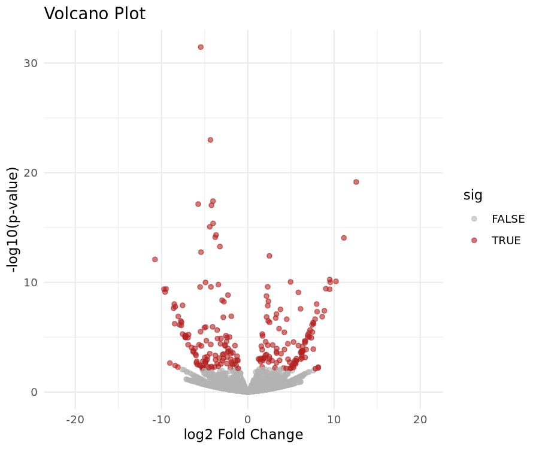
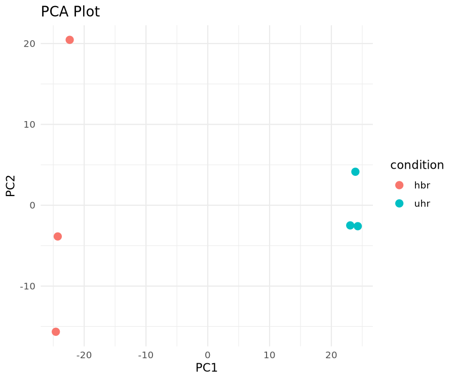
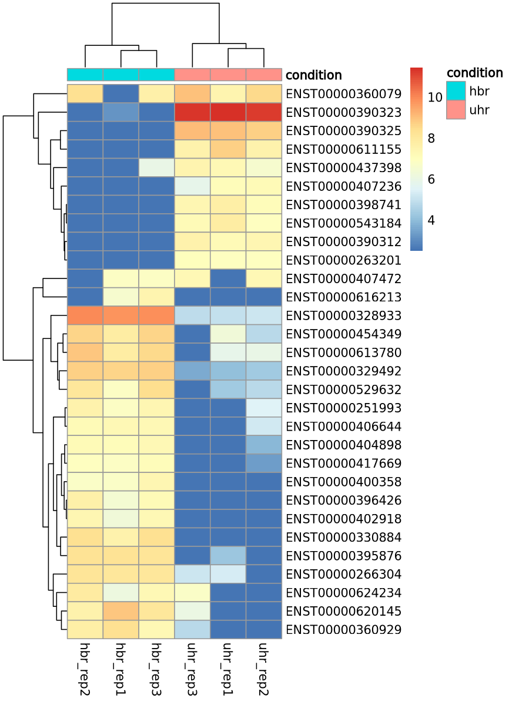

# Liquid Biopsy / RNA-seq Mini Pipeline


An end-to-end, reproducible pipeline for processing RNA-seq / liquid biopsy small-RNA data:
**QC & adapter trimming (fastp) → pseudo-alignment (Salmon) → differential expression & visualization (DESeq2, ggplot2, pheatmap in R)**.

Built with **Nextflow** (DSL2) for workflow standardization, **Docker** for reproducibility, and **GitHub Actions** for continuous testing.

## Why this pipeline

Liquid biopsy and small-RNA workflows require careful adapter trimming (short reads risk adapter read-through) and lightweight quantification suited to low-input, non-invasive blood/plasma samples. This pipeline mirrors a production-style setup: modular Nextflow processes, resource profiles, containerization, and CI validation — not a one-off analysis script.

## Data

This run uses the **Griffith Lab RNA-seq tutorial dataset** (chr22 + ERCC92 spike-in subset), a widely used teaching dataset comparing:
- **UHR** — Universal Human Reference (a pooled mix of RNA from 10 cancer cell lines)
- **HBR** — Human Brain Reference

Each condition has 3 replicates, pre-filtered to reads mapping to chromosome 22 for a fast, laptop-friendly pipeline run. Reference and read data are downloaded fresh (see below) rather than committed, since they're tens of MB — standard practice for bioinformatics repos.

The pipeline itself is data-agnostic: point `params.reads`, `params.transcriptome`, and `params.samplesheet` in `main.nf` at any paired-end FASTQ set, transcriptome FASTA, and condition table to run on your own data.

## Quick start

### Option A: Docker (recommended)

```bash
# 1. Download reference + annotation
mkdir -p data/reference
cd data/reference
wget http://genomedata.org/rnaseq-tutorial/fasta/GRCh38/chr22_with_ERCC92.fa
wget http://genomedata.org/rnaseq-tutorial/annotations/GRCh38/chr22_with_ERCC92.gtf
cd ../..

# 2. Download reads
mkdir -p data/raw
cd data/raw
wget http://genomedata.org/rnaseq-tutorial/HBR_UHR_ERCC_ds_5pc.tar
tar -xvf HBR_UHR_ERCC_ds_5pc.tar
# rename to match sample_R{1,2}.fastq pattern — see scripts/rename_reads.sh
cd ../..

# 3. Build and run
docker build -t liquid-biopsy-pipeline .
docker run -v $(pwd)/data:/pipeline/data liquid-biopsy-pipeline
```

### Option B: GitHub Codespaces (zero local installs)

Click **Code → Codespaces → Create codespace on main**. Everything (fastp, Salmon, Nextflow, R/DESeq2, gffread) installs automatically via `.devcontainer/devcontainer.json`.

```bash
conda activate pipeline
nextflow run main.nf -profile standard
```

## Pipeline steps

| Step | Tool | Purpose |
|------|------|---------|
| 1. QC/Trim | `fastp` | Adapter trimming, poly-G trimming, length filtering (15bp+) |
| 2. Transcript extraction | `gffread` | Build transcript FASTA from genome + GTF |
| 3. Index | `salmon index` | Build transcriptome index |
| 4. Quantify | `salmon quant` | Pseudo-alignment + transcript-level quantification |
| 5. Differential Expression | `DESeq2` (R, via `tximport`) | Identify significantly up/down-regulated transcripts |
| 6. Visualization | `ggplot2`, `pheatmap` | Volcano plot, PCA plot, expression heatmap |

## Results

Run on the HBR vs. UHR chr22 dataset (6 samples, 3 replicates per condition):

| Transcript | log2FoldChange | padj |
|---|---|---|
| ENST00000328933 | -5.46 | 2.1e-27 |
| ENST00000396425 | -4.33 | 1.7e-19 |
| ENST00000390323 | +12.56 | 7.3e-17 |
| ENST00000262795 | -4.05 | 8.8e-15 |

Full results: [`data/results/deseq2_results.csv`](data/results/deseq2_results.csv)

**Volcano plot** — significant transcripts (padj < 0.05, |log2FC| > 1) highlighted:




**PCA plot** — samples cleanly separate by condition:




**Heatmap** — top 30 most variable transcripts across samples:





## Repo structure

```
.
├── .devcontainer/devcontainer.json   # Codespaces auto-setup
├── .github/workflows/ci.yml          # CI smoke test on every push
├── main.nf                           # Nextflow pipeline entrypoint
├── modules/
│   ├── fastp.nf
│   ├── salmon.nf
│   └── deseq2.nf
├── bin/
│   └── deseq2_analysis.R             # DESeq2 + visualization script
├── nextflow.config                   # resource profiles (standard, ci)
├── Dockerfile
├── db/
│   └── schema.sql                    # SQLite schema for run/sample tracking
├── scripts/
│   └── log_run_to_db.py              # auto-logs each pipeline run to db/pipeline_runs.db
├── platform-admin/                   # disk monitoring, log rotation, cron scheduling
└── data/
    ├── raw/                          # input FASTQ (not committed — download fresh)
    ├── reference/                    # genome/GTF/transcriptome (not committed)
    ├── samplesheet.csv               # sample,condition mapping
    └── results/                      # pipeline outputs (plots + tables committed)
```

## Running on your own data

1. Add paired-end FASTQ files to `data/raw/` named `<sample>_R1.fastq` / `<sample>_R2.fastq`
2. Add your transcriptome FASTA to `data/reference/transcriptome.fa`
3. Update `data/samplesheet.csv` with `sample,condition` rows matching your sample names
4. Run as above — public liquid biopsy / plasma RNA-seq data can be sourced from [NCBI GEO](https://www.ncbi.nlm.nih.gov/geo/) or [SRA](https://www.ncbi.nlm.nih.gov/sra)

## Run tracking & platform administration

Every pipeline run is automatically logged to a local SQLite database (`db/pipeline_runs.db`) via `run_pipeline.sh`, capturing per-sample QC status, read retention, and the git commit used — useful for auditing runs across collaborators or over time. See `db/schema.sql` for the schema.

The `platform-admin/` directory contains operational tooling for running this as a persistent service rather than a one-off analysis: disk usage monitoring, log rotation, and cron scheduling. See [`platform-admin/README.md`](platform-admin/README.md) for details.

## Debugging notes / lessons learned

A few non-obvious issues surfaced while building this pipeline, worth noting for anyone extending it:

- **Nextflow `path` inputs need explicit `file()`/`Channel.fromPath()` wrapping** — passing a raw string param into a `path`-typed process input fails with `Not a valid path value` in recent Nextflow versions rather than implicitly converting.
- **`publishDir` + an already-named output directory can double-nest paths** — if a process emits `path "${sample_id}"` and `publishDir` also appends `${sample_id}`, results land at `outdir/sample_id/sample_id/` instead of `outdir/sample_id/`.
- **R's `file.path()` drops names from a named vector** — reattaching names after path construction (rather than assuming they persist) avoids silent `NA`-filled file lists that only surface as a downstream `file.exists()` failure.
- **`tximport` needs `dropInfReps = TRUE`** to avoid requiring the `jsonlite` package for Salmon's inferential replicate metadata, which isn't needed for a standard DESeq2 workflow.
- **`pheatmap`'s `annotation_col` requires row names matching the expression matrix's column names** — a samplesheet loaded via `read.csv()` needs `rownames()` set explicitly to the sample ID column.
- **DESeq2's default dispersion/VST curve-fitting needs a reasonably large gene set** — with very few genes (e.g. a small CI smoke-test fixture), both `DESeq()` and `vst()`/`varianceStabilizingTransformation()` need `fitType = "mean"` to avoid `locfit` failing with "out of vertex space", and `vst()` itself needs falling back to `varianceStabilizingTransformation()` below ~1000 genes.


## License

MIT
